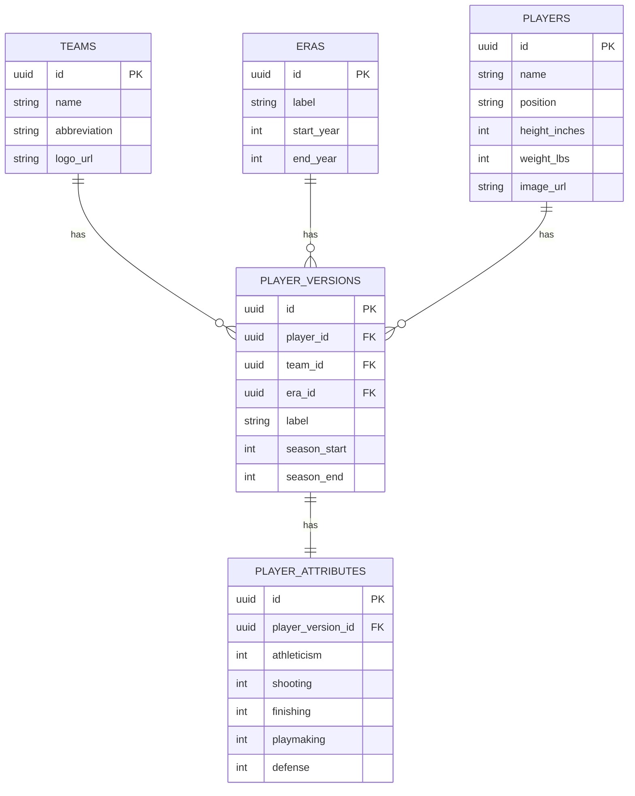

The MVP should use this schema with a small seeded dataset.

The seed dataset is only for getting the first playable version working. It should contain representative real teams, eras, players, player versions, and ratings, but it does not need to be complete.

Future production data should be able to populate these same tables without requiring gameplay or UI rewrites.

For MVP, `player_attributes` stores the final playable rating for each MVP category. Future versions may add calculated values, manual adjustment values, source metadata, or additional categories after the full rating-generation system is needed.

---

