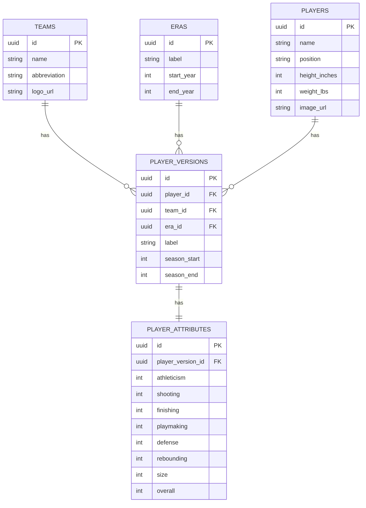

```mermaid
erDiagram
    TEAMS ||--o{ PLAYER_VERSIONS : has
    ERAS ||--o{ PLAYER_VERSIONS : has
    PLAYERS ||--o{ PLAYER_VERSIONS : has
    PLAYER_VERSIONS ||--|| PLAYER_ATTRIBUTES : has

    TEAMS {
        uuid id PK
        string name
        string abbreviation
        string logo_url
    }

    ERAS {
        uuid id PK
        string label
        int start_year
        int end_year
    }

    PLAYERS {
        uuid id PK
        string name
        string position
        int height_inches
        int weight_lbs
        string image_url
    }

    PLAYER_VERSIONS {
        uuid id PK
        uuid player_id FK
        uuid team_id FK
        uuid era_id FK
        string label
        int season_start
        int season_end
    }

    PLAYER_ATTRIBUTES {
        uuid id PK
        uuid player_version_id FK
        int athleticism
        int shooting
        int finishing
        int playmaking
        int defense
        int rebounding
        int size
        int overall
    }
```
